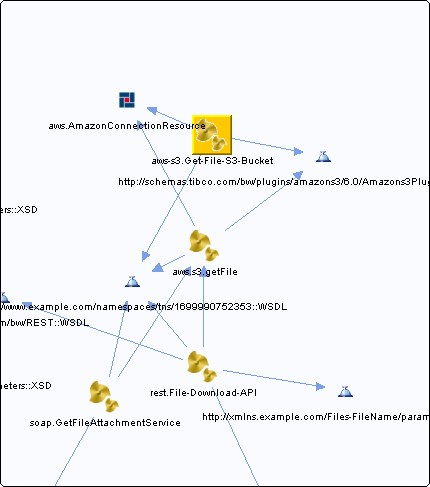

# Get-File-S3-Bucket.bwp {#Get-File-S3-Bucket.bwp .concept}

Chapter contains Get-File-S3-Bucket.bwp crossreferences documentation.

References To:

-   http://schemas.tibco.com/bw/plugins/amazons3/6.0/Amazons3PluginExceptions::WSDL
-   http://www.example.com/namespaces/tns/1699990752353::WSDL
-   [aws.AmazonConnectionResource](../../../projects/com.odido-rfp-demo.application_1.0.0_ear/resources/aws/AmazonConnectionResource.amazonconnectionResource.md)

**Parent topic:**[Processes](../../../cross/dependencies/processes/processes.md)

