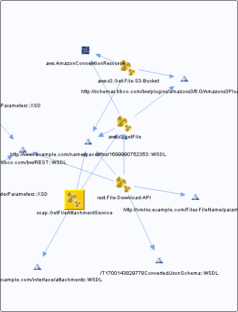

# GetFileAttachmentService.bwp {#GetFileAttachmentService.bwp .concept}

Chapter contains GetFileAttachmentService.bwp crossreferences documentation.

References To:

-   [http://www.example.com/interface/attachments::WSDL](../../../projects/com.odido-rfp-demo/Service_Descriptors/getFileAttachmentService.wsdl.md)
-   http://www.example.com/namespaces/tns/1699990752353::WSDL

Referenced From:

-   [rest.File-Download-API](../../../projects/com.odido-rfp-demo.application_1.0.0_ear/Processes/rest/File-Download-API.bwp.md)
-   [soap.GetFileAttachmentService](../../../projects/com.odido-rfp-demo.application_1.0.0_ear/Processes/soap/GetFileAttachmentService.bwp.md)

References To:

-   http://schemas.tibco.com/bw/plugins/amazons3/6.0/Amazons3PluginExceptions::WSDL
-   http://www.example.com/namespaces/tns/1699990752353::WSDL
-   [aws.AmazonConnectionResource](../../../projects/com.odido-rfp-demo.application_1.0.0_ear/resources/aws/AmazonConnectionResource.amazonconnectionResource.md)

**Parent topic:**[Processes](../../../cross/dependencies/processes/processes.md)

