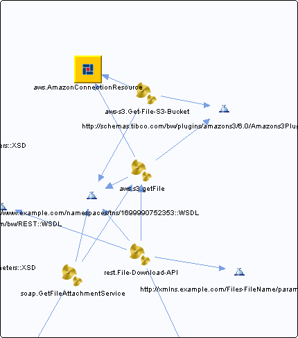

# AmazonConnectionResource.amazonconnectionResource {#AmazonConnectionResource.amazonconnectionResource .concept}

Chapter contains AmazonConnectionResource.amazonconnectionResource crossreferences documentation.

Referenced From:

-   [aws-s3.Get-File-S3-Bucket](../../../projects/com.odido-rfp-demo/Processes/aws-s3/Get-File-S3-Bucket.bwp.md)
-   [aws.s3.getFile](../../../projects/com.odido-rfp-demo.application_1.0.0_ear/Processes/aws/s3/getFile.bwp.md)

**Parent topic:**[Resources](../../../cross/dependencies/resources/resources.md)

