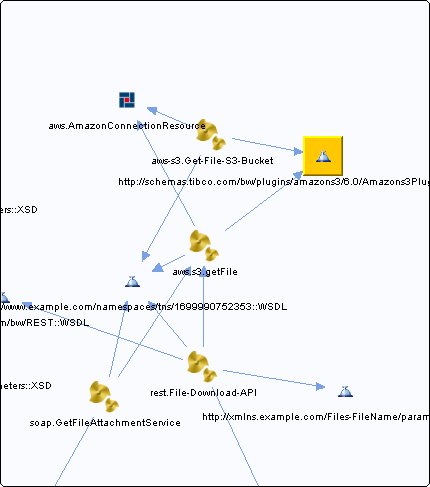

# http\_\_\_schemas.tibco.com\_bw\_plugins\_amazons3\_6.0\_Amazons3PluginExceptions\_\_WSDL\_\_unresolved {#http___schemas.tibco.com_bw_plugins_amazons3_6.0_Amazons3PluginExceptions__WSDL__unresolved .concept}

Chapter contains http\_\_\_schemas.tibco.com\_bw\_plugins\_amazons3\_6.0\_Amazons3PluginExceptions\_\_WSDL\_\_unresolved crossreferences documentation.

Referenced From:

-   [aws-s3.Get-File-S3-Bucket](../../../projects/com.odido-rfp-demo/Processes/aws-s3/Get-File-S3-Bucket.bwp.md)
-   [aws.s3.getFile](../../../projects/com.odido-rfp-demo.application_1.0.0_ear/Processes/aws/s3/getFile.bwp.md)
-   [aws-s3.Get-File-S3-Bucket](../../../projects/com.odido-rfp-demo.application_1.0.0_ear/Processes/aws-s3/Get-File-S3-Bucket.bwp.md)
-   [aws.s3.getFile](../../../projects/sharedLibrary/Processes/aws/s3/getFile.bwp.md)

**Parent topic:**[WSDLs](../../../cross/dependencies/wsdls/wsdls.md)

