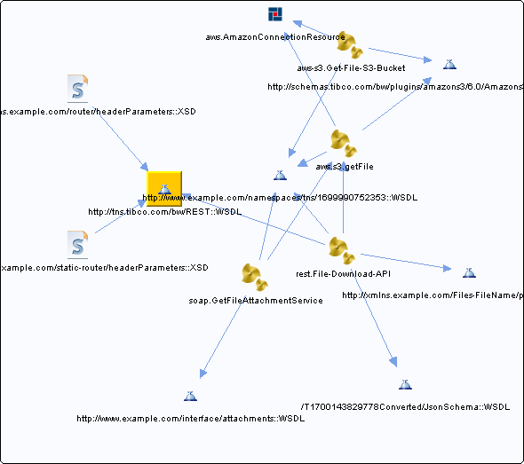

# http\_\_\_tns.tibco.com\_bw\_REST\_\_WSDL\_\_unresolved {#http___tns.tibco.com_bw_REST__WSDL__unresolved .concept}

Chapter contains http\_\_\_tns.tibco.com\_bw\_REST\_\_WSDL\_\_unresolved crossreferences documentation.

Referenced From:

-   [http://xmlns.example.com/router/headerParameters::XSD](../../../projects/com.odido-rfp-demo/Schemas/routerHeaderParameterSchema.xsd.md)
-   [http://xmlns.example.com/static-router/headerParameters::XSD](../../../projects/com.odido-rfp-demo/Schemas/static-routerHeaderParameterSchema.xsd.md)
-   [http://xmlns.example.com/router/headerParameters::XSD](../../../projects/com.odido-rfp-demo.application_1.0.0_ear/Schemas/routerHeaderParameterSchema.xsd.md)
-   [http://xmlns.example.com/static-router/headerParameters::XSD](../../../projects/com.odido-rfp-demo.application_1.0.0_ear/Schemas/static-routerHeaderParameterSchema.xsd.md)
-   [rest.File-Download-API](../../../projects/com.odido-rfp-demo/Processes/rest/File-Download-API.bwp.md)
-   [rest.File-Download-API](../../../projects/com.odido-rfp-demo.application_1.0.0_ear/Processes/rest/File-Download-API.bwp.md)

**Parent topic:**[WSDLs](../../../cross/dependencies/wsdls/wsdls.md)

