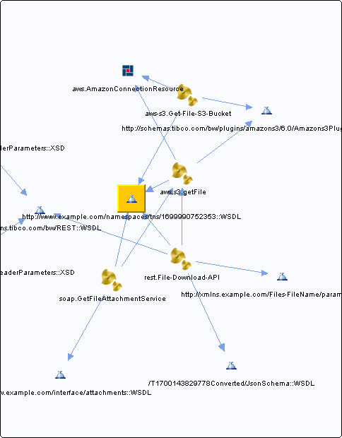

# http\_\_\_www.example.com\_namespaces\_tns\_1699990752353\_\_WSDL\_\_unresolved {#http___www.example.com_namespaces_tns_1699990752353__WSDL__unresolved .concept}

Chapter contains http\_\_\_www.example.com\_namespaces\_tns\_1699990752353\_\_WSDL\_\_unresolved crossreferences documentation.

Referenced From:

-   [aws-s3.Get-File-S3-Bucket](../../../projects/com.odido-rfp-demo/Processes/aws-s3/Get-File-S3-Bucket.bwp.md)
-   [rest.File-Download-API](../../../projects/com.odido-rfp-demo/Processes/rest/File-Download-API.bwp.md)
-   [soap.GetFileAttachmentService](../../../projects/com.odido-rfp-demo/Processes/soap/GetFileAttachmentService.bwp.md)
-   [aws.s3.getFile](../../../projects/com.odido-rfp-demo.application_1.0.0_ear/Processes/aws/s3/getFile.bwp.md)
-   [aws-s3.Get-File-S3-Bucket](../../../projects/com.odido-rfp-demo.application_1.0.0_ear/Processes/aws-s3/Get-File-S3-Bucket.bwp.md)
-   [rest.File-Download-API](../../../projects/com.odido-rfp-demo.application_1.0.0_ear/Processes/rest/File-Download-API.bwp.md)
-   [soap.GetFileAttachmentService](../../../projects/com.odido-rfp-demo.application_1.0.0_ear/Processes/soap/GetFileAttachmentService.bwp.md)
-   [aws.s3.getFile](../../../projects/sharedLibrary/Processes/aws/s3/getFile.bwp.md)

**Parent topic:**[WSDLs](../../../cross/dependencies/wsdls/wsdls.md)

