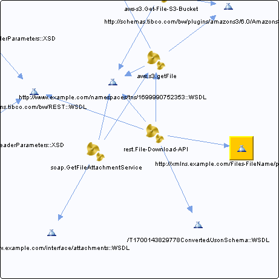

# http\_\_\_xmlns.example.com\_Files-FileName\_parameters\_\_WSDL\_\_unresolved {#http___xmlns.example.com_Files-FileName_parameters__WSDL__unresolved .concept}

Chapter contains http\_\_\_xmlns.example.com\_Files-FileName\_parameters\_\_WSDL\_\_unresolved crossreferences documentation.

Referenced From:

-   [rest.File-Download-API](../../../projects/com.odido-rfp-demo/Processes/rest/File-Download-API.bwp.md)
-   [rest.File-Download-API](../../../projects/com.odido-rfp-demo.application_1.0.0_ear/Processes/rest/File-Download-API.bwp.md)

**Parent topic:**[WSDLs](../../../cross/dependencies/wsdls/wsdls.md)

