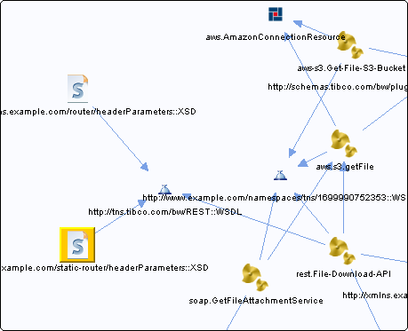

# static-routerHeaderParameterSchema.xsd {#static-routerHeaderParameterSchema.xsd .concept}

Chapter contains static-routerHeaderParameterSchema.xsd crossreferences documentation.

References To:

-   http://tns.tibco.com/bw/REST::WSDL

**Parent topic:**[XSDs](../../../cross/dependencies/xsds/xsds.md)

