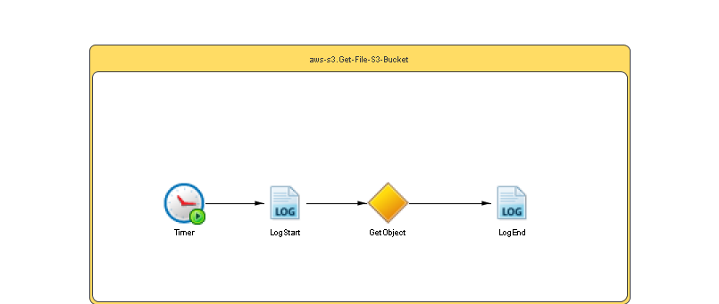

# Get-File-S3-Bucket {#ProcessMain .concept}

Section contains description of Process " Get-File-S3-Bucket.bwp " .

**Parent topic:**[Processes](../../../../projects/com.odido-rfp-demo.application_1.0.0_ear/common/process.md)

## Folder description: {#FolderDescription}

|Folder|Description|
|------|-----------|
| |No description|

## Process description: {#ProcessDescription}

|No description|

## Process definition: {#ProcessDefinition}

Full process path: aws-s3.Get-File-S3-Bucket

## Diagram: {#Diagram}



## Process starter activity: {#Starter}

### Name: **_Timer_** {#Timer}

-   Start Time:
-   Run Once:false
-   Time Interval:
-   Interval Unit:
-   End After: Never
-   Create Instance: yes
-   Description:

## Process properties: {#ProcessProperties}

|Name|Hot Update|Private Property|Shared Resource Type|Type|Property Source|
|----|----------|----------------|--------------------|----|---------------|
|amazons3Property|false|true|\{http://ns.tibco.com/bw/sharedresource/amazons3\}Amazons3ClientConfiguration|\{http://ns.tibco.com/bw/sharedresource/amazons3\}Amazons3ClientConfiguration| |
|fileKey|false|true| |xsd:string|[//sharedLibrary///EnvOperations/AWS-S3/fileKey](#Prod:%20User_Data.csv,%20default:%20User_Data.csv,%20Dev:%20User_Data.csv,%20Test:%20User_Data.csv,)|
|bucketName|false|true| |xsd:string|[//sharedLibrary///EnvOperations/AWS-S3/bucketName](#Prod:%20odido-bwce-demo-bucket,%20default:%20odido-bwce-demo-bucket,%20Dev:%20odido-bwce-demo-bucket,%20Test:%20odido-bwce-demo-bucket,)|
|destinationFileLocation|false|true| |xsd:string|[//sharedLibrary///EnvOperations/AWS-S3/destinationFileLocation](#Prod:%20/tmp/odido/s3/,%20default:%20/tmp/odido/s3/,%20Dev:%20/tmp/odido/s3/,%20Test:%20/tmp/odido/s3/,)|

## Activities: {#Activities}

### Name: **_GetObject_** {#GetObject}

-   Description: *No description*
-   Type: bw.amazons3.GetObject
-   Input Variable: *GetObject-input*
-   Output Variable: *GetObject*
-   *Input bindings:*
    -   Mapping table

        |Target|Source|
        |------|------|
        |**/tns1:GetSingleObjectInputFileClass****/tns1:bucketName**|$bucketName|
        |**/tns1:GetSingleObjectInputFileClass****/tns1:key**|$fileKey|
        |**/tns1:GetSingleObjectInputFileClass****/tns1:destinationFilePath**|concat\($destinationFileLocation, $fileKey\)|

    -   Mapping tree

        |Mapping|
        |-------|
        |        ```
**tns1:GetSingleObjectInputFileClasstns1:bucketName = **$bucketName**tns1:key = **$fileKey**tns1:destinationFilePath = **concat($destinationFileLocation, $fileKey)
        ```

|

    -   Source code

        |Mapping|
        |-------|
        |        ```
<?xml version="1.0" encoding="UTF-8"?>
<xsl:stylesheet xmlns:xsl="http://www.w3.org/1999/XSL/Transform" xmlns:tns1="http://www.tibco.com/namespaces/tnt/plugins/awss3+b5efd524-1e0a-48b8-9f69-29edeb9ba905+Input" version="2.0"><xsl:param name="fileKey"/><xsl:param name="bucketName"/><xsl:param name="destinationFileLocation"/><xsl:template name="GetObject-input" match="/"><tns1:GetSingleObjectInputFileClass><tns1:bucketName><xsl:value-of select="$bucketName"/></tns1:bucketName><tns1:key><xsl:value-of select="$fileKey"/></tns1:key><tns1:destinationFilePath><xsl:value-of select="concat($destinationFileLocation, $fileKey)"/></tns1:destinationFilePath></tns1:GetSingleObjectInputFileClass></xsl:template></xsl:stylesheet>
        ```

|


### Name: **_LogEnd_** {#LogEnd}

-   Description: *No description*
-   Type: bw.generalactivities.log
-   Logger Name:
-   Log level: *Info*
-   Suppress Job Info: *true*
-   Input Variable: *Log-input*
-   *Input bindings:*
    -   Mapping table

        |Target|Source|
        |------|------|
        |**/tns:ActivityInput****/message**|concat\(" \#\#\#\# Scheduler: Successfully Downloaded file : ",$fileKey, " at location :", $GetObject/Q1:destinationFilePath\)|

    -   Mapping tree

        |Mapping|
        |-------|
        |        ```
**tns:ActivityInputmessage = **concat(&quot; #### Scheduler:  Successfully Downloaded file : &quot;,$fileKey, &quot; at location :&quot;, $GetObject/Q1:destinationFilePath)
        ```

|

    -   Source code

        |Mapping|
        |-------|
        |        ```
<?xml version="1.0" encoding="UTF-8"?>
<xsl:stylesheet xmlns:xsl="http://www.w3.org/1999/XSL/Transform" xmlns:tns="http://www.tibco.com/pe/WriteToLogActivitySchema" xmlns:Q1="http://www.tibco.com/namespaces/tnt/plugins/awss3+b5efd524-1e0a-48b8-9f69-29edeb9ba905+Output" version="2.0"><xsl:param name="fileKey"/><xsl:param name="GetObject"/><xsl:template name="Log-input" match="/"><tns:ActivityInput><message><xsl:value-of select="concat(&quot; #### Scheduler:  Successfully Downloaded file : &quot;,$fileKey, &quot; at location :&quot;, $GetObject/Q1:destinationFilePath)"/></message></tns:ActivityInput></xsl:template></xsl:stylesheet>
        ```

|


### Name: **_LogStart_** {#LogStart}

-   Description: *No description*
-   Type: bw.generalactivities.log
-   Logger Name:
-   Log level: *Info*
-   Suppress Job Info: *true*
-   Input Variable: *LogStart-input*
-   *Input bindings:*
    -   Mapping table

        |Target|Source|
        |------|------|
        |**/tns:ActivityInput****/message**|concat\(" \#\#\#\# Scheduler: Downloading File : ",$fileKey, " from S3 Bucket : ",$bucketName\)|

    -   Mapping tree

        |Mapping|
        |-------|
        |        ```
**tns:ActivityInputmessage = **concat(&quot; #### Scheduler: Downloading File : &quot;,$fileKey, &quot; from S3 Bucket : &quot;,$bucketName)
        ```

|

    -   Source code

        |Mapping|
        |-------|
        |        ```
<?xml version="1.0" encoding="UTF-8"?>
<xsl:stylesheet xmlns:xsl="http://www.w3.org/1999/XSL/Transform" xmlns:tns="http://www.tibco.com/pe/WriteToLogActivitySchema" version="2.0"><xsl:param name="fileKey"/><xsl:param name="bucketName"/><xsl:template name="Log1-input" match="/"><tns:ActivityInput><message><xsl:value-of select="concat(&quot; #### Scheduler: Downloading File : &quot;,$fileKey, &quot; from S3 Bucket : &quot;,$bucketName)"/></message></tns:ActivityInput></xsl:template></xsl:stylesheet>
        ```

|


## Transitions: {#Transitions}

-   From: **_Timer_** -To: **_LogStart_**
    -   Label: **
    -   Type: SUCCESS

-   From: **_LogStart_** -To: **_GetObject_**
    -   Label: **
    -   Type: SUCCESS

-   From: **_GetObject_** -To: **_LogEnd_**
    -   Label: **
    -   Type: SUCCESS

