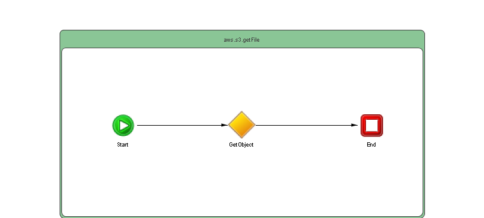

# getFile {#ProcessMain .concept}

Section contains description of Process " getFile.bwp " .

**Parent topic:**[Processes](../../../../../projects/com.odido-rfp-demo.application_1.0.0_ear/common/process.md)

## Folder description: {#FolderDescription}

|Folder|Description|
|------|-----------|
| |No description|

## Process description: {#ProcessDescription}

|No description|

## Process definition: {#ProcessDefinition}

Full process path: aws.s3.getFile

## Diagram: {#Diagram}



## Process starter activity: {#Starter}

### Name: **_Start_** {#Start}

-   Create Instance: yes
-   Description:

## Process properties: {#ProcessProperties}

|Name|Hot Update|Private Property|Shared Resource Type|Type|Property Source|
|----|----------|----------------|--------------------|----|---------------|
|amazons3Property|false|true|\{http://ns.tibco.com/bw/sharedresource/amazons3\}Amazons3ClientConfiguration|\{http://ns.tibco.com/bw/sharedresource/amazons3\}Amazons3ClientConfiguration| |
|fileKey|false|true| |xsd:string|[/EnvOperations/AWS-S3/fileKey](#)|

## Activities: {#Activities}

### Name: **_End_** {#End}

-   Description: *No description*
-   Type: bw.internal.end
-   Input Variable: *End-input*
-   *Input bindings:*
    -   Mapping table

        |Target|Source|
        |------|------|
        |**/tns1:FileContents****/tns1:metadata**|tib:render-xml\($GetObject/Q1:metadata,false\(\),false\(\)\)|
        |**/tns1:FileContents****/tns1:binaryData**|$GetObject/Q1:binaryContent|

    -   Mapping tree

        |Mapping|
        |-------|
        |        ```
**tns1:FileContentstns1:metadata = **tib:render-xml($GetObject/Q1:metadata,false(),false())**tns1:binaryData = **$GetObject/Q1:binaryContent
        ```

|

    -   Source code

        |Mapping|
        |-------|
        |        ```
<?xml version="1.0" encoding="UTF-8"?>
<xsl:stylesheet xmlns:xsl="http://www.w3.org/1999/XSL/Transform" xmlns:tns1="http://www.example.com/namespaces/tns/1699990752353" xmlns:Q1="http://www.tibco.com/namespaces/tnt/plugins/awss3+177a2143-e093-4c06-a51f-afa77ac37e42+Output" xmlns:tib="http://www.tibco.com/bw/xslt/custom-functions" version="2.0"><xsl:param name="GetObject"/><xsl:template name="End-input" match="/"><tns1:FileContents><tns1:metadata><xsl:value-of select="tib:render-xml($GetObject/Q1:metadata,false(),false())"/></tns1:metadata><tns1:binaryData><xsl:value-of select="$GetObject/Q1:binaryContent"/></tns1:binaryData></tns1:FileContents></xsl:template></xsl:stylesheet>
        ```

|


### Name: **_GetObject_** {#GetObject}

-   Description: *No description*
-   Type: bw.amazons3.GetObject
-   Input Variable: *GetObject-input*
-   Output Variable: *GetObject*
-   *Input bindings:*
    -   Mapping table

        |Target|Source|
        |------|------|
        |**/tns:GetSingleObjectInputBinaryContentClass****/tns:bucketName**|bw:getModuleProperty\("/EnvOperations/AWS-S3/bucketName"\)|
        |**/tns:GetSingleObjectInputBinaryContentClass****/tns:key**|$Start/tns1:FileName|

    -   Mapping tree

        |Mapping|
        |-------|
        |        ```
**tns:GetSingleObjectInputBinaryContentClasstns:bucketName = **bw:getModuleProperty(&quot;/EnvOperations/AWS-S3/bucketName&quot;)**tns:key = **$Start/tns1:FileName
        ```

|

    -   Source code

        |Mapping|
        |-------|
        |        ```
<?xml version="1.0" encoding="UTF-8"?>
<xsl:stylesheet xmlns:xsl="http://www.w3.org/1999/XSL/Transform" xmlns:tns="http://www.tibco.com/namespaces/tnt/plugins/awss3+177a2143-e093-4c06-a51f-afa77ac37e42+Input" xmlns:bw="http://www.tibco.com/bw/xpath/bw-custom-functions" xmlns:tns1="http://www.example.com/namespaces/tns/1699990752353" version="2.0"><xsl:param name="Start"/><xsl:template name="GetObject-input" match="/"><tns:GetSingleObjectInputBinaryContentClass><tns:bucketName><xsl:value-of select="bw:getModuleProperty(&quot;/EnvOperations/AWS-S3/bucketName&quot;)"/></tns:bucketName><tns:key><xsl:value-of select="$Start/tns1:FileName"/></tns:key></tns:GetSingleObjectInputBinaryContentClass></xsl:template></xsl:stylesheet>
        ```

|


## Transitions: {#Transitions}

-   From: **_Start_** -To: **_GetObject_**
    -   Label: **
    -   Type: SUCCESS

-   From: **_GetObject_** -To: **_End_**
    -   Label: **
    -   Type: SUCCESS

