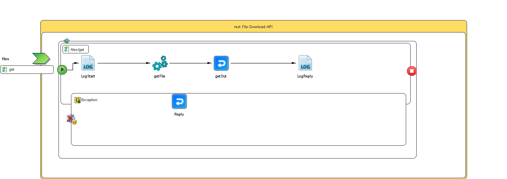

# File-Download-API {#ProcessMain .concept}

Section contains description of Process " File-Download-API.bwp " .

**Parent topic:**[Processes](../../../../projects/com.odido-rfp-demo.application_1.0.0_ear/common/process.md)

## Folder description: {#FolderDescription}

|Folder|Description|
|------|-----------|
| |No description|

## Process description: {#ProcessDescription}

|No description|

## Process definition: {#ProcessDefinition}

Full process path: rest.File-Download-API

## Diagram: {#Diagram}



## Process starter activity: {#Starter}

### Name: **_OnMessageStart_** {#OnMessageStart}

-   Constructor: onMessageStart
-   xpdlId: 8196f1c5-ce8f-46b0-baa4-61d5b6c25fec

## Process end activity: {#EndActivity}

### Name: **_OnMessageEnd_** {#OnMessageEnd}

-   Constructor: onMessageEnd
-   xpdlId: 64f77bcb-eba6-4954-84bb-4cfd8fb7adc7

## Process properties: {#ProcessProperties}

|Name|Hot Update|Private Property|Shared Resource Type|Type|Property Source|
|----|----------|----------------|--------------------|----|---------------|
|bucketName|false|true| |xsd:string|[//sharedLibrary///EnvOperations/AWS-S3/bucketName](#Prod:%20odido-bwce-demo-bucket,%20default:%20odido-bwce-demo-bucket,%20Dev:%20odido-bwce-demo-bucket,%20Test:%20odido-bwce-demo-bucket,)|

## Activities: {#Activities}

### Name: **_getFile_** {#getFile}

-   Description: *No description*
-   Input Variable: *getFile-input*
-   Output Variable: *getFile*
-   *Input bindings:*
    -   Mapping table

        |Target|Source|
        |------|------|
        |**/tns3:GetFileParameters****/tns3:FileName**|$get/parameters/tns5:filesGetParameters/tns5:FileName|

    -   Mapping tree

        |Mapping|
        |-------|
        |        ```
**
		tns3:GetFileParameters
			tns3:FileName = **$get/parameters/tns5:filesGetParameters/tns5:FileName
        ```

|

    -   Source code

        |Mapping|
        |-------|
        |        ```
<?xml version="1.0" encoding="UTF-8"?><xsl:stylesheet xmlns:xsl="http://www.w3.org/1999/XSL/Transform" xmlns:tns5="http://xmlns.example.com/Files-FileName/parameters" xmlns:tns3="http://www.example.com/namespaces/tns/1699990752353" version="2.0">
    <xsl:param name="get"/>
    <xsl:template name="getFile-input" match="/">
        <tns3:GetFileParameters>
            <tns3:FileName>
                <xsl:value-of select="$get/parameters/tns5:filesGetParameters/tns5:FileName"/>
            </tns3:FileName>
        </tns3:GetFileParameters>
    </xsl:template>
</xsl:stylesheet>

        ```

|

-   Spawn: *false*
-   Subprocess: [sharedLibrary/Processes/aws/s3/getFile.bwp](../../../sharedLibrary/Processes/aws/s3/getFile.bwp.md)

### Name: **_getOut_** {#getOut}

-   Service: files / operation: get
-   ReplyWith: Output Message
-   Description:
-   *Input bindings:*
    -   Mapping table

        |Target|Source|
        |------|------|
        |**/tns:getResponse****/item****/tns2:File**|$getFile/tns3:binaryData|

    -   Mapping tree

        |Mapping|
        |-------|
        |        ```
**
	  tns:getResponse
		 item
			tns2:File = **$getFile/tns3:binaryData
        ```

|

    -   Source code

        |Mapping|
        |-------|
        |        ```
<?xml version="1.0" encoding="UTF-8"?><xsl:stylesheet xmlns:xsl="http://www.w3.org/1999/XSL/Transform" xmlns:tns="http://xmlns.example.com/20231116151004PLT" xmlns:tns2="/T1700143829778Converted/JsonSchema" xmlns:tns3="http://www.example.com/namespaces/tns/1699990752353" xmlns:xsd="http://www.w3.org/2001/XMLSchema" version="2.0">
   <xsl:param name="getFile"/>
   <xsl:template name="getOut-input" match="/">
      <tns:getResponse>
         <item>
            <tns2:File>
               <xsl:value-of select="$getFile/tns3:binaryData"/>
            </tns2:File>
         </item>
      </tns:getResponse>
   </xsl:template>
</xsl:stylesheet>

        ```

|


### Name: **_LogReply_** {#LogReply}

-   Description: *No description*
-   Type: bw.generalactivities.log
-   Logger Name:
-   Log level: *Info*
-   Suppress Job Info: *true*
-   Input Variable: *LogReply-input*
-   *Input bindings:*
    -   Mapping table

        |Target|Source|
        |------|------|
        |**/tns4:ActivityInput****/message**|concat\(" \#\#\#\# ReST API: Successfully Downloaded file : ",$get/parameters/tns5:filesGetParameters/tns5:FileName, ", Response Sent..."\)|

    -   Mapping tree

        |Mapping|
        |-------|
        |        ```
**
	  tns4:ActivityInput
		 message = **concat(&quot; #### ReST API: Successfully Downloaded file : &quot;,$get/parameters/tns5:filesGetParameters/tns5:FileName, &quot;,  Response Sent...&quot;)
        ```

|

    -   Source code

        |Mapping|
        |-------|
        |        ```
<?xml version="1.0" encoding="UTF-8"?><xsl:stylesheet xmlns:xsl="http://www.w3.org/1999/XSL/Transform" xmlns:tns4="http://www.tibco.com/pe/WriteToLogActivitySchema" xmlns:tns5="http://xmlns.example.com/Files-FileName/parameters" version="2.0">
   <xsl:param name="get"/>
   <xsl:template name="LogReply-input" match="/">
      <tns4:ActivityInput>
         <message>
            <xsl:value-of select="concat(&quot; #### ReST API: Successfully Downloaded file : &quot;,$get/parameters/tns5:filesGetParameters/tns5:FileName, &quot;,  Response Sent...&quot;)"/>
         </message>
      </tns4:ActivityInput>
   </xsl:template>
</xsl:stylesheet>

        ```

|


### Name: **_LogStart_** {#LogStart}

-   Description: *No description*
-   Type: bw.generalactivities.log
-   Logger Name:
-   Log level: *Info*
-   Suppress Job Info: *true*
-   Input Variable: *LogStart-input*
-   *Input bindings:*
    -   Mapping table

        |Target|Source|
        |------|------|
        |**/tns4:ActivityInput****/message**|concat\(" \#\#\#\# ReST API: Downloading File : ",$get/parameters/tns5:filesGetParameters/tns5:FileName, " from S3 Bucket : ",$bucketName\)|

    -   Mapping tree

        |Mapping|
        |-------|
        |        ```
**
	  tns4:ActivityInput
		 message = **concat(&quot; #### ReST API: Downloading File : &quot;,$get/parameters/tns5:filesGetParameters/tns5:FileName, &quot; from S3 Bucket : &quot;,$bucketName)
        ```

|

    -   Source code

        |Mapping|
        |-------|
        |        ```
<?xml version="1.0" encoding="UTF-8"?><xsl:stylesheet xmlns:xsl="http://www.w3.org/1999/XSL/Transform" xmlns:tns4="http://www.tibco.com/pe/WriteToLogActivitySchema" xmlns:tns5="http://xmlns.example.com/Files-FileName/parameters" version="2.0">
   <xsl:param name="get"/>
   <xsl:param name="bucketName"/>
   <xsl:template name="LogStart-input" match="/">
      <tns4:ActivityInput>
         <message>
            <xsl:value-of select="concat(&quot; #### ReST API: Downloading File : &quot;,$get/parameters/tns5:filesGetParameters/tns5:FileName, &quot; from S3 Bucket : &quot;,$bucketName)"/>
         </message>
      </tns4:ActivityInput>
   </xsl:template>
</xsl:stylesheet>

        ```

|


### Name: **_Reply_** {#Reply}

-   Service: files / operation: get
-   ReplyWith:
-   Description:
-   *Input bindings:*
    -   Mapping table

        |Target|Source|
        |------|------|
        |**/tns:get5XXFaultMessage****/serverError****/tns1:server5XXError****/statusCode**|500|
        |**/tns:get5XXFaultMessage****/serverError****/tns1:server5XXError****/message**|"Internal Server Error"|

    -   Mapping tree

        |Mapping|
        |-------|
        |        ```
**
	  tns:get5XXFaultMessage
		 serverError
			tns1:server5XXError
			   statusCode = **500**
			   message = **&quot;Internal Server Error&quot;
        ```

|

    -   Source code

        |Mapping|
        |-------|
        |        ```
<?xml version="1.0" encoding="UTF-8"?><xsl:stylesheet xmlns:xsl="http://www.w3.org/1999/XSL/Transform" xmlns:tns="http://xmlns.example.com/20231116151004PLT" xmlns:tns1="http://tns.tibco.com/bw/REST" version="2.0">
   <xsl:template name="Reply-input" match="/">
      <tns:get5XXFaultMessage>
         <serverError>
            <tns1:server5XXError>
               <statusCode>
                  <xsl:value-of select="500"/>
               </statusCode>
               <message>
                  <xsl:value-of select="&quot;Internal Server Error&quot;"/>
               </message>
            </tns1:server5XXError>
         </serverError>
      </tns:get5XXFaultMessage>
   </xsl:template>
</xsl:stylesheet>

        ```

|


## References: {#References}

## Transitions: {#Transitions}

-   From: **_getFile_** -To: **_getOut_**
    -   Label: **
    -   Type: SUCCESS

-   From: **_OnMessageStart_** -To: **_LogStart_**
    -   Label: **
    -   Type: SUCCESS

-   From: **_LogStart_** -To: **_getFile_**
    -   Label: **
    -   Type: SUCCESS

-   From: **_getOut_** -To: **_LogReply_**
    -   Label: **
    -   Type: SUCCESS

